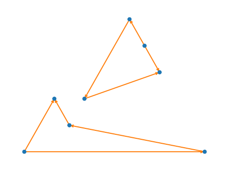

Convergence study
=================

Convergence studies are now possible in a natural way (IMO)

.. code-block:: console

   $ mkdir converge_si_new
   $ cd converge_si_new
   $ ase build Si structure.json -x diamond
   
   $ asr run "asr.gs --calculator {'name':'gpaw','mode':{'name':'pw','ecut':300},'kpts':{'density':2},'txt':None}"
   $ asr run "asr.gs --calculator {'name':'gpaw','mode':{'name':'pw','ecut':400},'kpts':{'density':2},'txt':None}"

   $ asr cache ls
                            name                                  parameters
               asr.gs::calculate {'atoms': Atoms(symbols='Si2', pbc=True,...
               asr.gs::calculate {'atoms': Atoms(symbols='Si2', pbc=True,...
                    asr.gs::main {'atoms': Atoms(symbols='Si2', pbc=True,...
                    asr.gs::main {'atoms': Atoms(symbols='Si2', pbc=True,...
   asr.magnetic_anisotropy::main {'atoms': Atoms(symbols='Si2', pbc=True,...
   asr.magnetic_anisotropy::main {'atoms': Atoms(symbols='Si2', pbc=True,...
              asr.magstate::main {'atoms': Atoms(symbols='Si2', pbc=True,...
              asr.magstate::main {'atoms': Atoms(symbols='Si2', pbc=True,...

   $ asr cache ls name=asr.gs::main -f "parameters.calculator.mode.ecut result.etot:.2f"
   ecut   etot
   300 -11.81
   400 -11.82

   $ asr cache graph --draw --saveto deps_graph2.svg

