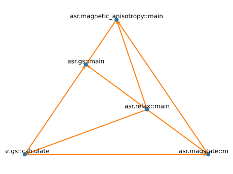

Dependencies
============

You have already seen the graphs. Pretty much self-explanatory. Think
of them in terms of data flow.

One funny aside. Not all dependencies are alike.

.. literalinclude:: dependencies.py

The same behaviour can be obtained at the command line:

.. code-block:: console

   $ ase build Ag unrelaxed.json -x fcc

   $ asr run "relax --calculator name='emt'" | asr run "gs --atoms stdin.result.atoms --calculator name='gpaw',precision='low',txt=None"
