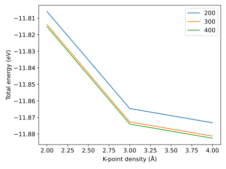

===================
Scripting interface
===================

The recipes can be called directly as regular python functions making
more advanced operations that are not easily done in the terminal
easily obtainable:

.. literalinclude:: converge-si.py
   :linenos:
   :emphasize-lines: 13-21, 30-32

If I run the script again, it will run very quickly, since everything
already was calculated.

.. code-block::

   $ p converge-si.py
   asr.gs::main: Found cached record.uid=6a4975cc171b47c28c2fa8f52038d8c2
   asr.gs::main: Found cached record.uid=60f2a9bc721d42e8877656fde583155e
   asr.gs::main: Found cached record.uid=ac46b78c46b948399c3829d07ce055f8
   asr.gs::main: Found cached record.uid=a7977ad9dbda4f9aaedd36566adc75ac
   asr.gs::main: Found cached record.uid=4108625786e9412d95ad5382cf630758
   asr.gs::main: Found cached record.uid=0b2dd0f3e1e74a67b4ff829224dbec44
   asr.gs::main: Found cached record.uid=ee0e6f0b882144638f4d0f29b79b16fb
   asr.gs::main: Found cached record.uid=3a5dbf6073414c3f860b6769f89cb8cd
   asr.gs::main: Found cached record.uid=67785f4d333f49c996502fb85f430525
